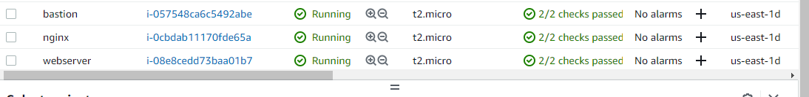

# Documentation of project 15

1. I created a VPC and named it "VPC-ACS"

  

2. I enabled the DNS hostnames

  

3. I created an internet gateway and attched it to my vpc

    
     

4.  I created subnets

     

5. I created Route tables and associated it with my subnets

       
        

6. I created six security groups

     
      
       
        
         
          
           

7. I created two access points for wordpress and tooling

       
        
         

8. I created a key and named it "ACS-rds"

     

9. I created a subnet group

     

10. I created a database
     
      

11. I launched three new instances namely; bastion,nginx and webserver

     

12. I installed the dependencies needed for the instances I created

     
      
       
        
         
          

13. I created target groups

      
       
        
         

14. I created AMI's
    
     

15.  I created two load balancers; internal and external

    
    
    

16. I created four launch templates

   
   
   

17. I configured auto-scaling groups

   
   
   
   
   
   
   
   

18. I confirmed if my mysql was working fine
   
     
     

19. I created new records in my route53 hosted zones

     
     
     

20. I confirmed if my target group was healthy

    

21. I ssh into my instance to confirm if my commands ran very well without issues

    
    
    
    
    
